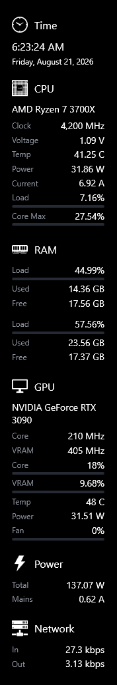

<div align="center">


# Sidebar Pc Monitor

**See what your PC is doing — without touching your games.**

CPU, GPU, RAM, drives, network, and how much power the whole machine is pulling, live on the edge of your screen.

[](https://github.com/oubahell/Sidebar-Pc-Monitor/releases/latest/download/SidebarPcMonitor-win-Setup.exe)

[](https://github.com/oubahell/Sidebar-Pc-Monitor/releases/latest)
[](https://github.com/oubahell/Sidebar-Pc-Monitor/releases)
[](LICENSE.md)
[](#requirements)

<br />



<sub>The Gamer preset in the Bars layout, High-Contrast Dark theme.</sub>

</div>

---

## Why this one

Most PC monitors draw their numbers **on top of your game**. To do that, tools like the
NVIDIA App overlay and MSI Afterburner (through RivaTuner) load their own code *inside
the game itself*. That technique is called injection.

Most of the time it works fine. When it doesn't, you get a game that stutters, won't
start, crashes for no clear reason, or an anti-cheat that objects to code it didn't
expect. If you have ever switched overlays off one at a time to find which one broke
your game, you know the evening it costs.

**Sidebar Pc Monitor never goes near your game.** It is an ordinary window on your
desktop. It reads the sensors your motherboard and graphics card already report and
draws them on its own panel, off to one side. Your game does not know it is running —
so it cannot be the thing that breaks it.

|  | Overlay tools | Sidebar Pc Monitor |
|---|---|---|
| Loads code into your game | Yes | **No** |
| Can it cause a game to crash or stutter | Possible | **No — it isn't in there** |
| Anything for anti-cheat to notice in-game | Possible | **Nothing** |
| Where the numbers appear | On top of the game | Beside it, on your desktop |
| Background services | Usually | **None — close it and it's gone** |

The trade is honest: readings sit **next to** your game rather than over it. That suits
a second monitor, or borderless windowed on a single screen. In exchange, the thing
watching your PC can never be the thing that spoils your session.

## Download

| | | |
|---|---|---|
| [**Setup.exe**](https://github.com/oubahell/Sidebar-Pc-Monitor/releases/latest/download/SidebarPcMonitor-win-Setup.exe) | Recommended | Installs for you, no admin needed to install, updates itself |
| [**Installer (.msi)**](https://github.com/oubahell/Sidebar-Pc-Monitor/releases/latest/download/SidebarPcMonitor-win.msi) | For IT | Installs for every user on the machine |
| [**Portable (.zip)**](https://github.com/oubahell/Sidebar-Pc-Monitor/releases/latest/download/SidebarPcMonitor-win-Portable.zip) | No install | Unzip and run |

Those links always give you the newest version. [See all releases →](https://github.com/oubahell/Sidebar-Pc-Monitor/releases)

> **On first run Windows may say "Windows protected your PC."** The app isn't signed with a
> paid certificate yet. Click **More info → Run anyway**. The full source is right here if
> you'd rather build it yourself.

Uninstall from **Settings → Apps** like anything else. It takes everything with it —
files, shortcuts, its start-with-Windows entry and its settings.

## What it shows

- **CPU** — temperature, clock, voltage, load, busiest core, watts and amps
- **GPU** — temperature, core and memory clocks, load, VRAM used, watts, fan speed
- **RAM** — physical and virtual memory
- **Drives** — free space, activity, read and write speeds
- **Network** — up and down speed, local and external IP
- **Power** — what the whole machine is drawing, in watts and in amps
- Graphs for any reading, alerts when something crosses a limit, and global hotkeys

### Power: the number nobody else gives you

Most monitors stop at each part. This one adds a **Power** panel that answers the
question you actually have: *what is this machine costing me right now?*

Your CPU and graphics card report their own wattage, and those are read directly.
Everything that can't report itself — memory, drives, fans, chipset, losses in the
power supply — is covered by an estimate you can adjust. The total is divided by your
PSU's efficiency to get draw at the wall, then by your mains voltage to get amps.

It says **(est.)** for a reason. The two parts that dominate and swing with load are
really measured, so it follows your usage honestly, but the final figure carries
whatever error is in the estimate for the rest. All three numbers — overhead watts,
PSU efficiency and mains voltage — are yours to set under **Settings → Monitors → Power**.

## Make it yours

### Pick how much detail you want

Turning every reading on at once is a wall of numbers, so start from one of these:

| Preset | Good for |
|---|---|
| **Simple** | temperature, load and power at a glance |
| **Gamer** | thermals, headroom, VRAM and fan speed — what explains a frame-rate drop |
| **Advanced** | everything, down to voltages, current and per-drive activity |
| **Custom** | exactly what you tick yourself |

### Four themes

**High-Contrast Dark**, **Modern Flat**, **Gaming RGB** and **Windows 11 Fluent**.
Every colour stays adjustable afterwards, with a **Reset Colors** button to get the
theme's own palette back.

### Four layouts — or write your own

*How* each reading is drawn is separate from *which* readings you show. Four ship built
in: **Classic**, **Compact**, **Bars** and **Tiles**.

They are plain XAML files, so you can add your own. Drop one into:

```
%LocalAppData%\SidebarPcMonitor\Layouts\MyStyle.xaml
```

and it appears under **Settings → General → Layout**. No rebuild, no code. Each file
defines one `DataTemplate` keyed `MetricTemplate`, bound to:

| Binding | What it gives you |
|---|---|
| `Label` / `FullName` | short and long name |
| `Text` | formatted value with units, e.g. `49 C` |
| `Value` | the raw number, for bars and gauges |
| `IsPercent` | true when a bar is meaningful |
| `IsAlert` / `AlertColor` | a limit has been crossed |

Copy any file in [`SidebarDiagnostics/Layouts/`](SidebarDiagnostics/Layouts) as a starting
point — each is commented as a worked example. A layout that fails to parse falls back to
Classic instead of breaking the app.

## Requirements

- Windows 11, 10, 8.1 or 7
- [.NET Framework 4.8.1](https://dotnet.microsoft.com/download/dotnet-framework/net481)
- The app asks for administrator rights when it starts — reading hardware sensors needs them

### About the driver

CPU temperature, clocks, voltages and motherboard fan sensors can only be read through a
kernel driver. Since v0.9.5 LibreHardwareMonitor uses [PawnIO](https://pawnio.eu) for this.
Without it, those specific readings show `0` and everything else still works.

PawnIO comes **bundled** and is offered on first run — it's a signed, open-source driver,
and the app asks before installing it. Say no and it carries on without those readings.

## Building

Two projects, built separately — the app is a legacy `.csproj` and can't build the
SDK-style sensor library through a project reference:

```powershell
# 1. The sensor library
dotnet build "LibreHardwareMonitor\LibreHardwareMonitorLib\LibreHardwareMonitorLib.csproj" -c Release

# 2. The app
msbuild "SidebarDiagnostics\SidebarPcMonitor.csproj" /p:Configuration=Release
```

See [DEVELOPMENT.md](DEVELOPMENT.md) for architecture notes and the traps worth knowing.

## Credits

Built on [**Sidebar Diagnostics**](https://github.com/ArcadeRenegade/SidebarDiagnostics) by
[**ArcadeRenegade**](https://github.com/ArcadeRenegade) — the original design and
implementation are theirs, and this fork wouldn't exist without it. If you find this
useful, go and star the original too.

Sensor data comes from [**LibreHardwareMonitor**](https://github.com/LibreHardwareMonitor/LibreHardwareMonitor),
with kernel access via [**PawnIO**](https://pawnio.eu) by namazso.

Maintained by **ObaiDa.A**.

## License

**GNU General Public License v3.0** — see [LICENSE.md](LICENSE.md).

Bundled components keep their own licences: LibreHardwareMonitor under MPL-2.0 and PawnIO
under GPL-2.0-or-later. Full attribution, and the source offer PawnIO's licence requires,
are in [NOTICE.md](NOTICE.md).
